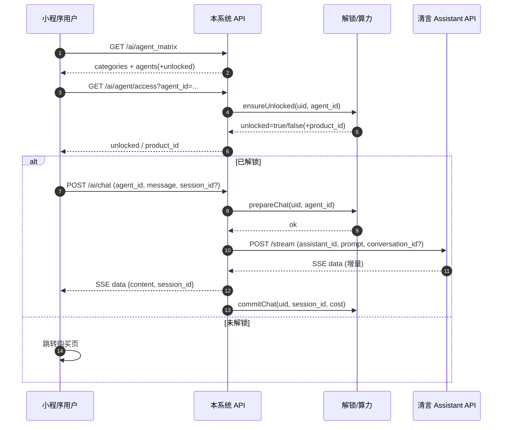

# 清言智能体纳管与小程序集成方案（设计文档）

## 1. 目标与范围
- 目标：将已在“智谱清言”平台创建的智能体纳入本系统后台统一管理，并在小程序“智能体矩阵”中渲染与对话。
- 范围：
  - 后台：新增/编辑/上下架/校验清言智能体；批量导入清言智能体目录。
  - 小程序：不感知“清言”，继续消费本系统矩阵与聊天接口。
  - 后端：在既有 AI 矩阵、解锁、会话、算力扣费链路中新增 provider=qingyan 分发。
- 不做：
  - 不在本系统后台编辑清言侧 Prompt/知识库/工具配置（仍在清言平台维护）。
  - 不从清言自动同步展示字段（名称/头像/简介/标签等），展示字段以本系统后台为准。

## 2. 约定与决策
- 规则A（试用策略）：沿用小程序既有“未解锁不试用/引导购买”策略。
- 规则B（算力）：清言智能体聊天纳入本系统算力扣费（统一 prepare/commit）。
- 规则C（展示字段）：清言智能体展示字段以后台维护为准，不做自动同步。

## 3. 现有链路复用点
- 矩阵：`GET /api/ai/agent_matrix` 输出分类 + 智能体列表。
- 解锁：按 `agent_id` 维度判断用户是否解锁（商品购买/解锁记录），不与清言耦合。
- 会话：本系统 `session_id` 对应一段对话；远端会话上下文通过 `remote_conversation_id` 复用。
- SSE：本系统对前端输出 SSE `data: {content, session_id}`，前端不关心上游模型来源。

## 4. 清言 API 摘要（基于《清言接口文档.md》）
- Root：`https://chatglm.cn/chatglm/assistant-api/v1/`
- 鉴权：`Authorization: Bearer {access_token}`
- Token：
  - `POST /get_token` 入参 `api_key/api_secret` → `access_token/expires_in`（有效期约 10 天）
- 对话：
  - `POST /stream`：SSE 流式输出；入参 `assistant_id/prompt/conversation_id?`
  - `POST /stream_sync`：非流式（适合后台“验证连接”）
- 文件（可选能力）：
  - `POST /file_upload`：返回 `file_id`，对话时 `file_list` 传入
- 问后推（可选能力）：
  - `POST /suggest/prompts`：入参 `conversation_id/log_id` → 建议列表

## 5. 核心设计：Provider + 映射纳管
### 5.1 Provider 枚举
- `local`：当前系统内置智能体（默认）
- `qingyan`：清言外部智能体

### 5.2 智能体映射模型（建议最小改动）
在现有 `ai_agents` 表基础上增加字段（推荐）：
- `provider`：varchar，默认 `local`
- `provider_assistant_id`：varchar，清言 `assistant_id`
- `provider_meta`：text/json，可扩展字段（例如是否开启文件能力、提示词模板版本等）

说明：
- 展示字段仍使用 `ai_agents` 原字段（agent_name/avatar/description/tags/category_id/sort/status）。
- 业务字段（售卖绑定/赠送算力/解锁记录）仍以本系统 `agent_id` 为唯一主键。

### 5.3 解锁与售卖绑定（不变）
- 清言智能体依然可绑定本系统商品用于解锁（沿用 `ai_agent_goods` / `ai_agent_unlock`）。
- 未解锁行为沿用既有策略：点击后走 `GET ai/agent/access`，未解锁引导购买。

## 6. 后台管理交互设计（运营友好）
### 6.1 单条新增/编辑（清言）
- 路径：后台「AI -> 智能体管理」新增/编辑。
- 新增字段：
  - 来源（provider）：local / qingyan
  - 清言 assistant_id（provider_assistant_id）
- 展示字段：名称、简介、头像、分类、标签、排序、状态（上架/下架）
- 商业字段：绑定商品、赠送算力、仅已解锁可见（如产品需要）

### 6.2 “验证连接”按钮（强烈建议）
目的：避免 assistant_id 填错/无权限/被删除等导致线上不可用。

动作：
1) 使用后台配置的 `api_key/api_secret` 获取 token（或复用缓存 token）。
2) 调用 `POST /stream_sync`：
   - `assistant_id = provider_assistant_id`
   - `prompt = "ping"`（固定探活文本）
   - `conversation_id` 不传
3) 校验成功：展示 “可用”，并展示返回 `conversation_id`（仅用于提示）。
4) 校验失败：展示清言 `status/message`（例如：10010 被删除、10018 无权限）。

### 6.3 批量导入（推荐落地方式）
背景：文档未提供“列出我所有 assistant”接口说明，难以自动同步目录。

交互：
- “批量导入”弹窗：支持 CSV/JSON 粘贴或文件上传。
- 字段建议：`assistant_id, 名称, 分类, 标签`
- 导入后默认状态：下架（status=0），运营逐条验证连接后上架。

## 7. 后端服务改造点（高层）
### 7.1 矩阵输出增加 provider 信息（可选）
- 当前前端只需 `id/name/desc/tags/cate` 与 `unlocked`。
- 可选输出：`provider`（便于排错与统计），前端可忽略。

### 7.2 聊天分发（关键）
入口仍为 `POST /api/ai/chat`，在服务端按 `agent_id` 查 `ai_agents.provider` 分流：
- `local`：走现有模型/应用链路
- `qingyan`：
  - 解锁校验：沿用 `ensureUnlocked(uid, agentId)`
  - 算力：沿用 `prepareChat/commitChat`
  - 上游调用：清言 `POST /stream`，把清言 SSE 增量转换为本系统 SSE 输出
  - 续聊：本系统 `ai_chat_sessions.remote_conversation_id` <-> 清言 `conversation_id`

## 8. Token 缓存策略（安全与稳定）
- 后台配置项：
  - `qingyan_api_key`
  - `qingyan_api_secret`
- 运行期缓存：
  - `qingyan_access_token`
  - `qingyan_access_token_expires_at`
- 刷新策略：
  - token 不存在或即将过期（例如 <24h）则刷新
  - 刷新失败：返回明确错误给后台“验证连接”或聊天接口
- 安全要求：
  - 不在日志中打印 `api_secret/access_token`
  - 后台接口返回也不泄露 token

## 9. SSE 适配策略（清言 -> 本系统）
### 9.1 输入映射
- `assistant_id`：来自 `ai_agents.provider_assistant_id`
- `prompt`：用户输入
- `conversation_id`：
  - 若本系统会话存在 `remote_conversation_id`，则传入（续聊）
  - 否则不传（新会话）

### 9.2 输出映射（第一期只支持文本）
清言流式输出的 `message.content` 可能是多种 `type`：
- `type=text`：抽取 `text` 作为增量，转发到前端 SSE：`data: {"content": "...", "session_id": ...}`
- 其他类型（image/tool_calls/code 等）：
  - 第一阶段：忽略或转换为一条提示文本（例如“该消息类型暂不支持展示”），避免前端渲染异常。

### 9.3 远端会话ID持久化
- 当清言返回 `conversation_id` 时：
  - 写入本系统 `ai_chat_sessions.remote_conversation_id`（如果列存在）
  - 否则降级缓存（与现有逻辑一致）

## 10. 错误处理与用户提示
### 10.1 清言错误映射（建议）
- 并发超限（10007）/当日次数超限（10008）：前端提示“服务繁忙，请稍后重试”
- 无权限（10018）/智能体被删除（10010）：前端提示“智能体不可用，请联系管理员”
- 风控拦截（流式 error_code=10031）：提示“内容触发风控，请调整提问”

### 10.2 运营侧排错
- 后台“验证连接”可直接暴露清言的 `status/message`，作为配置正确性的强校验。

## 11. 数据与权限边界
- 本系统 user -> agent 解锁与算力扣费逻辑不依赖清言侧用户体系。
- 清言侧 `assistant_id` 只作为“生成服务端点”的外键，不参与本系统权限判断。
- 若未来出现“多套清言账号/多租户”需求，可在 `provider_meta` 中增加 `tenant_key` 并在 token 缓存中按租户隔离。

## 12. 时序图（端到端）

## 13. 开发拆分建议（供后续开工使用）
- 数据库：`ai_agents` 增加 provider/provider_assistant_id/provider_meta
- 后台：
  - 表单：新增 provider 选择与 assistant_id 字段
  - 列表：新增 provider 显示与筛选
  - “验证连接”：调用清言 token + stream_sync
  - 批量导入：CSV/JSON
- 后端：
  - 清言 client：token 缓存 + stream/stream_sync 请求封装
  - chat 分发：按 provider 选择上游；SSE 适配；conversation_id 持久化
  - 错误映射：清言 status/error_code → 统一错误提示

